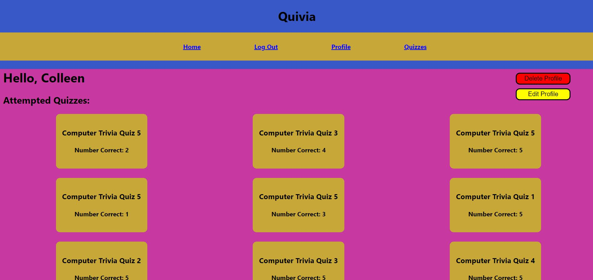

# [Quivia Quiz App](https://quivia-quiz-app.netlify.app/)

Quivia is a full stack, single-page web application built using React.js and Ruby on Rails.
Routing is implemented using React Router and Authentication is implemented using JSON Web Tokens.
Here, users can test their trivia knowledge by taking quizzes on various trivia subjects.

To attempt a quiz, users must first log in to an existing account or create an account by providing a username and password:

Once logged in, users can attempt a quiz by navigating to the Quizzes page:

Quizzes consist of multiple choice questions with four possible answers:

After attempting a quiz, users can view all previous attempts by navigating to their profile page. Here, users can also change their username or delete their profile:

## Future Updates

In the future, I plan on adding the following features to the app:
- Reset password from the profile page
- Reset a forgotten password
- Add user statistics to the profile page
-Add a leader board